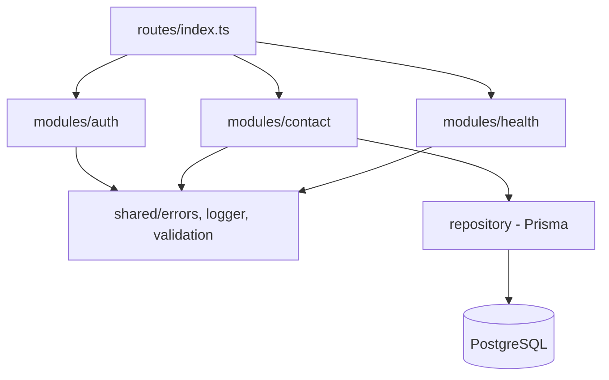

# Backend Architecture

Express.js modular monolith, organized by business domain.



## Request lifecycle

```
Request
  -> security middleware (Helmet, CORS, rate limiter)
  -> body parsing
  -> route match (/api/v1/<domain>)
  -> Zod schema validation
  -> controller (thin: parse + delegate)
  -> service (business logic)
  -> repository (Prisma data access)
  -> response envelope (see docs/api/conventions.md)
  -> centralized error handler (on throw, at any layer)
```

## Module template

See `apps/api/AGENTS.md` for the exact file layout every module follows
(`routes/controller/service/repository/schema/types/tests`).

## Why modular monolith, not microservices

A single deployable process is simpler to build, test, deploy, and reason
about at this stage, while the domain-separated module structure preserves
the option to extract a module into its own service later — with an ADR —
if scale or team-size actually requires it.
