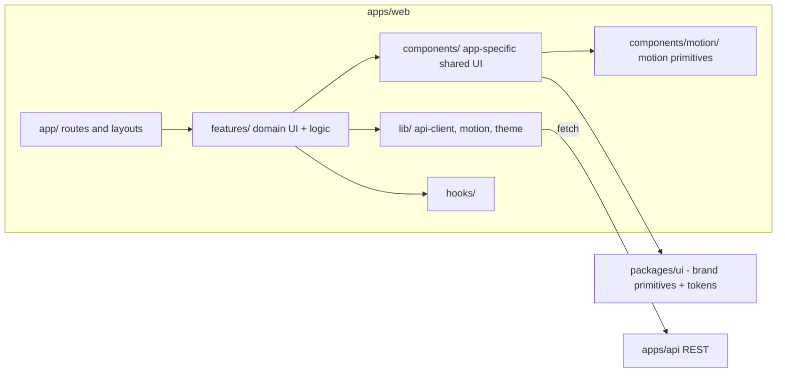

# Frontend Architecture

Next.js (App Router) + TypeScript + Tailwind + Framer Motion.

## UI primitives

Brand primitives in `packages/ui` (`Button`, `Badge`, `Card`, `Input`,
`Textarea`) are hand-rolled on top of the design tokens rather than generated
from shadcn/ui. Rationale: the surface we need is small, shadcn/ui's copy-in
model would place component source in `apps/web` (where brand primitives do not
belong per the root `AGENTS.md`), and it pulls in `class-variance-authority`,
`clsx`, `tailwind-merge`, and Radix packages we do not otherwise use. Revisit
via ADR if we need genuinely complex interactive primitives (combobox, dialog,
date picker) — that is where Radix earns its weight.

## Theming

Semantic design tokens are emitted as CSS custom properties by the Tailwind
plugin in `apps/web/tailwind.config.ts`; dark is the default scheme and `.light`
on `<html>` overrides it. Theme state lives on the document and is read with
`useSyncExternalStore` (`src/lib/theme.ts`), applied before first paint by an
inline script in the root layout. See `../frontend/design-system.md`.

## Motion

Shared motion vocabulary in `src/lib/motion.ts` (backed by tokens in
`packages/ui/src/tokens/motion.ts`) and primitives in `components/motion/`.
Effects with no state (marquee, gradient-mesh backdrop) are implemented in CSS
as Server Components so they add no client bundle. See
`../frontend/animation-guidelines.md`.

## Rendering strategy

- Server Components by default for data-driven, non-interactive content
  (fast, SEO-friendly, smaller client bundle).
- Client Components (`"use client"`) only where interactivity is required
  (forms, animated components, anything using state/effects/browser APIs).

## State management

- Server state (data from the API) via TanStack Query.
- Local/UI state via React state/hooks. No global client state library is
  introduced until a real cross-page state need justifies it.

## Forms

- React Hook Form + Zod resolver. Schemas shared with the backend via
  `packages/validation` wherever the same shape is validated server-side
  (e.g. the contact form).

See `../frontend/design-system.md` for tokens/components and
`../frontend/accessibility.md` / `../frontend/responsive-design.md` /
`../frontend/animation-guidelines.md` for cross-cutting UI rules.
