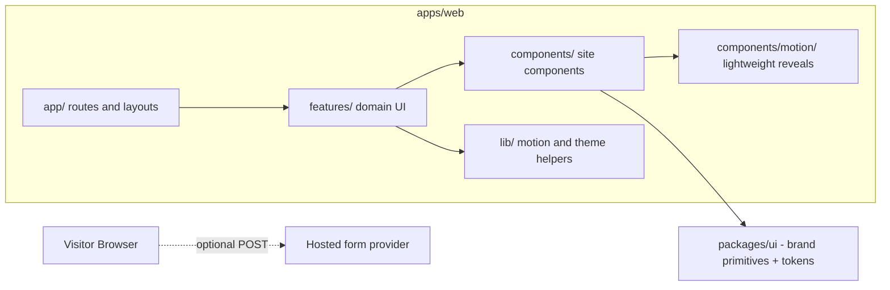

# Frontend Architecture

Next.js (App Router) + TypeScript + Tailwind + Framer Motion.

## UI primitives

Brand primitives in `packages/ui` (`Button`, `Badge`, `Card`, `Input`,
`Textarea`) are hand-rolled on top of the design tokens. The surface is small,
so adding shadcn/Radix would increase dependencies without solving a current
problem.

## Theming

Semantic design tokens are emitted as CSS custom properties by the Tailwind
plugin in `apps/web/tailwind.config.ts`; dark is the default scheme and `.light`
on `<html>` overrides it. Theme state is read with `useSyncExternalStore`
(`src/lib/theme.ts`) and applied before first paint by the inline script in the
root layout.

## Motion and performance

Shared motion vocabulary lives in `src/lib/motion.ts`, backed by tokens in
`packages/ui/src/tokens/motion.ts`. `Reveal`, `Stagger`, and `RevealText` are
used for purposeful entrances; the marquee and gradient backdrop stay CSS-only
Server Components.

The current budget intentionally avoids global scroll listeners, per-card
pointer handlers, scroll-linked parallax, continuous SVG grain, and stacked
large blur layers. See `../frontend/animation-guidelines.md`.

## Rendering strategy

- Server Components by default for pages, content, cards, decorative surfaces,
  and the native contact form.
- Client Components only for navigation state, theme selection, and reveal
  choreography.
- Static content lives in `apps/web/src/data`.
- Contact delivery is an optional direct POST to the configured hosted provider;
  no local API or database is part of this phase.
