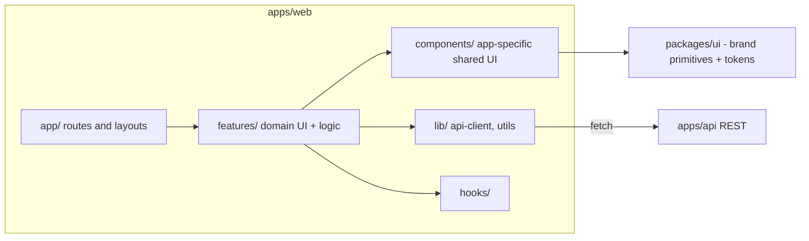

# Frontend Architecture

Next.js (App Router) + TypeScript + Tailwind + shadcn/ui.

## Rendering strategy
- Server Components by default for data-driven, non-interactive content
  (fast, SEO-friendly, smaller client bundle).
- Client Components (`"use client"`) only where interactivity is required
  (forms, animated components, anything using state/effects/browser APIs).

## State management
- Server state (data from the API) via TanStack Query.
- Local/UI state via React state/hooks. No global client state library is
  introduced until a real cross-page state need justifies it.

## Forms
- React Hook Form + Zod resolver. Schemas shared with the backend via
  `packages/validation` wherever the same shape is validated server-side
  (e.g. the contact form).

See `../frontend/design-system.md` for tokens/components and
`../frontend/accessibility.md` / `../frontend/responsive-design.md` /
`../frontend/animation-guidelines.md` for cross-cutting UI rules.
