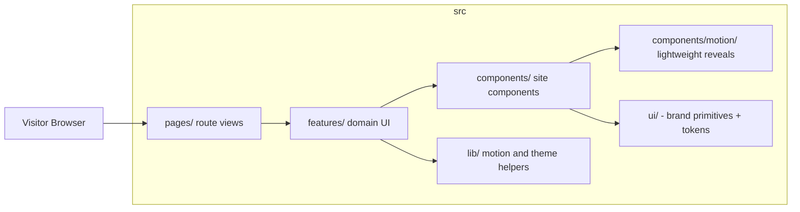

# Frontend Architecture

Vite 6 + React 19 + TypeScript + Tailwind CSS + Framer Motion + React Router 7.

## UI primitives

Brand primitives in `src/ui/components` (`Button`, `Badge`, `Card`, `Input`, `Textarea`) are hand-rolled on top of the design tokens (`src/ui/tokens`).

## Theming

Semantic design tokens are emitted as CSS custom properties by the Tailwind plugin in `tailwind.config.ts`; dark is the default scheme and `.light` on `<html>` overrides it. Theme state is managed with `useSyncExternalStore` (`src/lib/theme.ts`) and persisted in `localStorage`.

## Motion and performance

Shared motion vocabulary lives in `src/lib/motion.ts`, backed by tokens in `src/ui/tokens/motion.ts`. `Reveal`, `Stagger`, and `RevealText` are used for purposeful entrances.

The performance budget intentionally avoids heavy continuous SVG grain or unoptimized blur layers.

## Client Routing Strategy

- Instant, 0ms latency SPA transitions using React Router 7 (`react-router-dom`).
- All static portfolio content is structured in `src/data/`.
