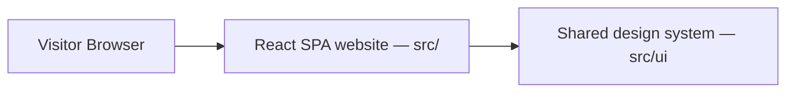

# System Architecture

## Current phase

AST is a frontend-first portfolio website built as a modern client-side React application with Vite.

There is no Express API, PostgreSQL database, Prisma layer, Docker service, or message queue in the current phase.

## Architecture

- Client-side SPA routing via React Router 7.
- Static project/service data lives in `src/data/`.
- Brand primitives and semantic tokens live in `src/ui/`.
- Fast static hosting support (Vercel, Netlify, Cloudflare Pages, GitHub Pages).
