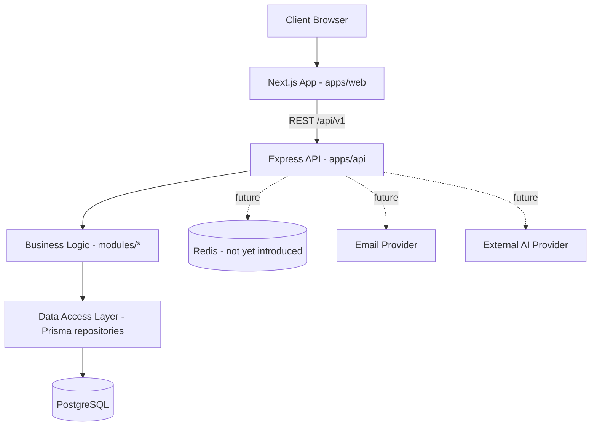

# System Architecture

## High-level flow

## Principles
- **Modular monolith, not microservices.** One deployable API process
  today; internal modules are separated by business domain so they *could*
  be extracted later if justified (see `../decisions/`).
- **Frontend and backend are separately deployable** apps in the same
  monorepo, communicating only over the versioned REST API — no direct
  database access from the frontend.
- **Shared code lives in `packages/`,** never duplicated between apps.

## Current external dependencies
None required for v1 beyond PostgreSQL. Email delivery (for contact form
notifications) is a near-term addition — TBD provider, tracked as a future
ADR-worthy decision if it introduces new infra.

## Not yet introduced (do not add without an ADR)
- Redis / caching layer
- Message queue / background job runner
- Additional microservices
- External AI/LLM provider integration
