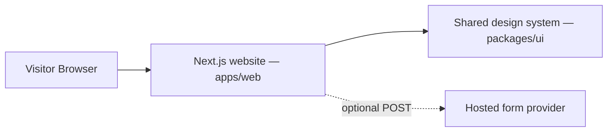

# System Architecture

## Current phase

ATS is a frontend-first portfolio website. The runtime is one Next.js App
Router application with static site content and a small shared UI package.

There is no Express API, PostgreSQL database, Prisma layer, Docker service, or
message queue in the current phase. Keeping those out is intentional: static
portfolio pages do not need persistence.

## Rendering strategy

- Server Components by default for pages, content, cards, the contact form,
  and decorative CSS surfaces.
- Client Components only for menu state, theme selection, and the small
  Framer Motion reveal choreography that adds value to the reading flow.
- Static project/service data lives in `apps/web/src/data`.
- Brand primitives and semantic tokens live in `packages/ui`.

## Contact boundary

The contact form is a native HTML POST form. The deployment can set
`NEXT_PUBLIC_CONTACT_FORM_ENDPOINT` to a hosted form provider such as
Formspree, Basin, or FormSubmit. The provider is responsible for delivery,
spam handling, and any retention. ATS does not persist visitor data locally.

If lead management becomes a real requirement, create an ADR before adding an
API, database, authentication, or a new runtime service. See
`README.md` for the future-product boundary.
